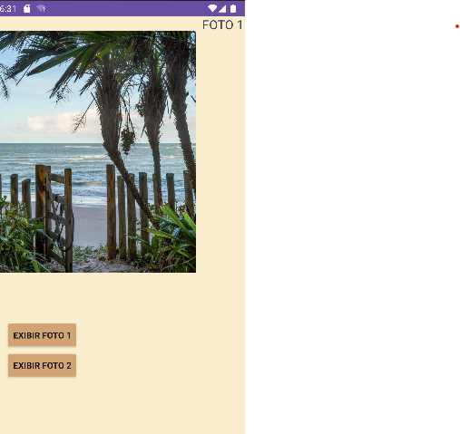
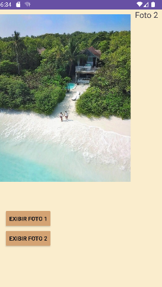

# visualizar_img

<h1>SOBRE O PROJETO:</h1>

O projeto tem como propósito intensificar a aprendizagem de java, foi feito um visualizador de imagem básico  onde possui duas imagens para serem visualizadas;

<h1>TELA DO PROJETO</h1>

  
   
  

